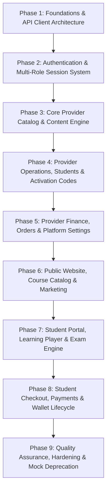

# Rewaa Platform: Frontend-Backend Integration Master Plan (Phased Roadmap)

> **Document Version**: 1.0.0**Target Frameworks**: Next.js 16 (App Router), TanStack Query v5, Axios, Zustand, React 19**Backend Architecture**: Laravel 12+ (PHP 8.3+) with Laravel Sanctum, Spatie MediaLibrary, Astrotomic Translatable**Reference Specifications**:
>
> - [`API_LIST.md`](file:///home/amr-mohamed27/rewaa/frontend/docs/backend/API_LIST.md) (Full 228-endpoint inventory & status)
> - [`API_SCHEMAS.md`](file:///home/amr-mohamed27/rewaa/frontend/docs/backend/API_SCHEMAS.md) (Request / Response DTO models & enums)
> - [`API_ASSIMILATION_GUIDE.md`](file:///home/amr-mohamed27/rewaa/frontend/docs/backend/API_ASSIMILATION_GUIDE.md) (Component & state migration details)
> - [`LESSONS_INTEGRATION_CONTEXT.md`](file:///home/amr-mohamed27/rewaa/frontend/docs/backend/LESSONS_INTEGRATION_CONTEXT.md) (Phase 4 Lessons deep architecture, API contracts & component mapping)
> - [`EXAMS_AND_QUESTIONS_INTEGRATION_CONTEXT.md`](file:///home/amr-mohamed27/rewaa/frontend/docs/backend/EXAMS_AND_QUESTIONS_INTEGRATION_CONTEXT.md) (Phase 4 Exams & Questions deep architecture, API contracts & component mapping)

---

## Executive Summary

The Rewaa platform frontend previously operated primarily with mock data and local storage abstractions (`*-storage.ts`). The Laravel backend exposes 228 endpoints (183 in-scope for frontend integration across Provider Dashboard, Website & Student Portal, and Shared General APIs).

This document establishes a **rigorous, multi-phased roadmap** to systematically connect the frontend to the backend without service disruption, maintaining clean architecture, type safety, multi-tenancy context, and bilingual localization (Arabic / English).

---

## Running the Laravel Backend Locally

Follow these steps to run the backend API server on your local development machine:

### 1. Prerequisites Check

Ensure PHP 8.3+ and Composer are installed:

```bash
php -v        # Must be >= 8.3 (e.g. PHP 8.4)
composer -v   # Must be >= 2.x
```

### 2. Environment Configuration

From the repository root, go into `backend/`:

```bash
cd backend
```

If `.env` does not exist, copy `.env.example`:

```bash
cp .env.example .env
```

Ensure the key variables in `backend/.env` are set:

```env
APP_NAME=Rewaa
APP_ENV=local
APP_KEY=base64:...          # If empty, run: php artisan key:generate
APP_DEBUG=true
APP_URL=http://localhost:8000

# Database (Default is SQLite for quick local development)
DB_CONNECTION=sqlite
# For MySQL/PostgreSQL, uncomment and configure DB_HOST, DB_DATABASE, DB_USERNAME, DB_PASSWORD

# Cache & Session
SESSION_DRIVER=database     # or file
CACHE_STORE=file            # change to 'file' or 'array' if Redis is not running locally
QUEUE_CONNECTION=database   # or sync
```

> [!TIP]
> **Redis Note**: If you do not have Redis running locally, change `CACHE_STORE=redis` to `CACHE_STORE=file` or `CACHE_STORE=array` in `backend/.env` to prevent connection errors.

### 3. Install Dependencies & Prepare Database

Run Composer install, database migrations, seeders, and storage link:

```bash
# 1. Install PHP dependencies
composer install

# 2. Generate application encryption key (if not already set)
php artisan key:generate

# 3. Run database migrations
php artisan migrate

# 4. (Optional) Seed standard data (Countries, Governorates, Stages, Admin user)
php artisan db:seed

# 5. Link storage directory for Spatie MediaLibrary uploads and images
php artisan storage:link
```

### 4. Start the Local Backend Server

Start the built-in development server on port 8000:

```bash
php artisan serve --port=8000
```

Your backend API is now accessible at:
👉 **`http://localhost:8000`**
Test endpoint: `http://localhost:8000/api/general/countries` or `http://localhost:8000/up`

### 5. Running Queue Workers (Optional / For Background Jobs)

If you need async emails, notifications, or file processing:

```bash
php artisan queue:listen --tries=1
```

---

## Phase Breakdown Matrix



---

## Phase 1: Core Client Infrastructure & Foundations

### Objective

Upgrade HTTP client tooling, TanStack Query configuration, environment definitions, global error handling, and localization headers to match Laravel backend expectations.

### Deliverables & Action Items

1. **Environment Variables Configuration** (`.env.local` / `.env.production`):
   - Configure `NEXT_PUBLIC_API_URL` (e.g. `http://localhost:8000`).
   - Configure fallback defaults and asset URL bases for Spatie MediaLibrary.

2. **Modernize `src/lib/apiClient.ts`**:
   - **Sanctum Bearer Injection**: Attach `Authorization: Bearer <token>` dynamically from storage/cookie. Distinguish or unify token access across roles.
   - **Bilingual Header Injection**: Pass `Accept-Language` (`ar` or `en`) extracted from active `next-intl` locale / HTML lang attribute.
   - **API Response Envelope Unwrapping**: Unpack `ApiResponse<T>` (`{ status: 200, message: "...", data: T }`) automatically so services receive clean payload `T`.
   - **Unified Error Handling**: Transform Laravel `422 Unprocessable Content` validation errors (`errors: Record<string, string[]>`) into consumable UI error structures. Handle `401 Unauthorized` and `403 Forbidden` with redirect or refresh logic.

3. **TanStack Query Client Standardization**:
   - Establish query key conventions: `["provider", ...]` and `["student", ...]`.
   - Set up default retry strategies, cache garbage collection (`gcTime`), and `staleTime` for static lookup endpoints (`/options`, `/countries`, etc.).

4. **Shared Types & DTO Verification**:
   - Ensure standard pagination interface matches backend: `{ current_page, data, total, per_page, last_page, links }`.
   - Setup enum mappings (e.g. `CourseDeliveryModeEnum`, `CourseStatusEnum`, `QuestionDifficultyEnum`, `PaymentStatusEnum`).

---

## Phase 2: Dual-Role Authentication & Session Lifecycle

### Objective

Migrate login, registration, token persistence, and route protection for both Provider and Student realms.

### Deliverables & Action Items

1. **Token & Session Store Architecture**:
   - Create auth state managers (e.g. Zustand or cookies):
     - `useProviderAuthStore`: provider token, permissions, profile.
     - `useStudentAuthStore`: student token, active stage, wallet summary.
   - Store Sanctum tokens in cookies/localStorage with secure attributes.

2. **Provider Authentication Integration**:
   - **Endpoints**:
     - `POST /api/dashboard/provider/auth/login` (Provider login)
     - `POST /api/dashboard/provider/auth/logout` (Revoke token)
     - `GET /api/dashboard/provider/profile` (Current provider profile & tenant)
   - Update Provider login forms, dashboard layout guards, and redirect handlers.

3. **Student Authentication Integration**:
   - **Endpoints**:
     - `POST /api/website/auth/login` (Student login via email/phone)
     - `POST /api/website/auth/register` (Student registration with stage/governorate)
     - `POST /api/website/auth/logout` (Student logout)
     - `GET /api/website/profile` (Student profile)
   - Update student login/register modals and route protection under `(student-dashboard)`.

4. **Middleware & Route Guards**:
   - Next.js middleware / client layout route guards checking token validity and role entitlement (`can:dashboard:provider` vs `can:app:student`).

---

## Phase 3: Provider Dashboard — Course, Section & Content Hierarchy (Completed)

### Objective

Eliminate `mockCoursesData.ts` and `courses-storage.ts`. Connect course creation, stage/subject relations, section reordering, and media uploads to live endpoints.

### Deliverables & Action Items

1. **Course Options Preloading Hook (`useCourseOptions`)** [x]:
   - `GET /api/dashboard/provider/courses/options`
   - Cache stages, subjects, instructors, subscription periods for selects and filters.

2. **Courses Management Views (`ManageCoursesClient`)** [x]:
   - `GET /api/dashboard/provider/courses`
   - Support dynamic query parameters: `search`, `status`, `delivery_mode`, `educational_stage_id`, `page`, `per_page`.
   - Replace client-side item counters with server-provided `status_counts` (`all`, `published`, `draft`, `scheduled`, `archived`).
   - Added `scheduled` status tab with counts.
   - Added Refresh button.

3. **Course Mutation & Creation Flows (`NewCourseClient` / Edit Course)** [x]:
   - `POST /api/dashboard/provider/courses` (Handle `multipart/form-data` with `cover_image`, `intro_video_url`, bilingual `title.ar`, `title.en`, `description.ar`, `description.en`).
   - `GET /api/dashboard/provider/courses/{course}` (Prefill form state).
   - `PUT /api/dashboard/provider/courses/{course}` (Update course).
   - `DELETE /api/dashboard/provider/courses/{course}` (Soft delete).
   - `POST /api/dashboard/provider/courses/{course}/restore` (Restore from trash).

4. **Curriculum & Section Management** [x]:
   - `POST /api/dashboard/provider/courses/{course}/sections`
   - `PUT /api/dashboard/provider/courses/{course}/sections/{section}`
   - `DELETE /api/dashboard/provider/courses/{course}/sections/{section}`
   - `POST /api/dashboard/provider/courses/{course}/sections/reorder` (Reorder drag-and-drop hierarchy).
   - Source course section import via parallel `POST` requests.
   - Section-level exam linking (`exam_id`, `requires_exam_pass_to_unlock_next_section`).

---

## Phase 4: Provider Dashboard — Lessons, Exams & Question Bank

### Objective

Eliminate `lessons-storage.ts`, `exams-storage.ts`, and `questions-storage.ts`. Implement lesson authoring, question banks, and exam builders.

### Deliverables & Action Items

1. **Lessons Engine (`ManageLessonsClient`, `NewLessonClient`, `LessonDialog`)** [x]:
   - **Context & Reference**: [LESSONS_INTEGRATION_CONTEXT.md](./LESSONS_INTEGRATION_CONTEXT.md)
   - **Endpoints**:
     - `GET /api/dashboard/provider/lessons` (Filtering, search, pagination, status counts, classification tabs)
     - `GET /api/dashboard/provider/lessons/options` (Stages, subjects, instructors, courses, sections, exams)
     - `POST /api/dashboard/provider/lessons` (Multipart FormData with cover_image, pdf_files[], explanatory_images[])
     - `GET /api/dashboard/provider/lessons/{lesson}` (Prefetching full lesson details & relations)
     - `PUT /api/dashboard/provider/lessons/{lesson}` (Update with method spoofing `_method=PUT` for multipart)
     - `DELETE /api/dashboard/provider/lessons/{lesson}` (Soft delete with dialog confirmation)
     - `POST /api/dashboard/provider/lessons/reorder` (Curriculum ordering)
   - Completely eliminated `getStoredLessons`, `saveStoredLessons`, and `mockLessonsData` across all provider views.
   - Connected `LessonDialog` in `NewCourseClient` / Curriculum builder and standalone roster `ManageLessonsClient`.

2. **Question Bank Management** [x]:
   - **Context & Reference**: [EXAMS_AND_QUESTIONS_INTEGRATION_CONTEXT.md](./EXAMS_AND_QUESTIONS_INTEGRATION_CONTEXT.md)
   - **Endpoints**:
     - `GET /api/dashboard/provider/questions` (Filter by stage, subject, difficulty, type, classification, instructor, search, pagination)
     - `GET /api/dashboard/provider/questions/options` (Stages, subjects, instructors, types, difficulties, classifications, exams)
     - `POST /api/dashboard/provider/questions` (MCQ, True/False, Essay, bilingual text and explanations, options validation)
     - `GET /api/dashboard/provider/questions/{question}`
     - `PUT /api/dashboard/provider/questions/{question}`
     - `DELETE /api/dashboard/provider/questions/{question}`
     - `PATCH /api/dashboard/provider/questions/reorder`
   - Completely eliminated local storage mock dependencies in Question management views (`ManageQuestionsClient`, `NewQuestionClient`, `EditQuestionClient`).

3. **Exams Engine (`ManageExamsClient`, `ExamFormClient`, `ExamDetailsClient`, `ExamStatsClient`, `ExamComplaintsClient`)** [x]:
   - **Context & Reference**: [EXAMS_AND_QUESTIONS_INTEGRATION_CONTEXT.md](./EXAMS_AND_QUESTIONS_INTEGRATION_CONTEXT.md)
   - **Endpoints**:
     - `GET /api/dashboard/provider/exams` (Status tabs with backend `status_counts`, filtering, search, pagination)
     - `GET /api/dashboard/provider/exams/options` (Stages, subjects, instructors, courses)
     - `POST /api/dashboard/provider/exams` (Settings: duration, passing percentage, attempts limit, delivery mode, classification)
     - `GET /api/dashboard/provider/exams/{exam}` (Full exam details, sections, and questions)
     - `PUT /api/dashboard/provider/exams/{exam}` (Update settings)
     - `DELETE /api/dashboard/provider/exams/{exam}` (Soft delete)
     - `PATCH /api/dashboard/provider/exams/{exam}/publish`
     - `PATCH /api/dashboard/provider/exams/{exam}/schedule`
     - `PATCH /api/dashboard/provider/exams/{exam}/convert-to-course`
     - `GET /api/dashboard/provider/exams/{exam}/sections`
     - `POST /api/dashboard/provider/exams/{exam}/sections`
     - `PUT /api/dashboard/provider/exams/{exam}/sections/{section}`
     - `DELETE /api/dashboard/provider/exams/{exam}/sections/{section}`
     - `PATCH /api/dashboard/provider/exams/{exam}/sections/reorder`
   - Completely eliminated mock storage fallbacks in provider exams views. Step 1 seamlessly creates draft exams and passes real IDs to Step 2 for sections and questions authoring.

---

## Phase 5: Provider Dashboard — Operations, Finance & Settings

### Objective

Deprecate `students-storage.ts`, `activation-codes-storage.ts`, `billing-requests-storage.ts`, and `settings-storage.ts`.

### Deliverables & Action Items

1. **Students Directory & Wallet Adjustments**:
   - `GET /api/dashboard/provider/students` (Paginated roster with search & filters)
   - `GET /api/dashboard/provider/students/options`
   - `POST /api/dashboard/provider/students` (Manual provider enrollment)
   - `GET /api/dashboard/provider/students/{student}` (Detail view, course enrollments, attendance)
   - `PATCH /api/dashboard/provider/students/{student}/status` (Activate / Suspend)
   - `POST /api/dashboard/provider/students/{student}/wallet/adjustments` (Manual credit/debit adjustment)

2. **Activation Codes & Batch Management**:
   - `GET /api/dashboard/provider/activation-code-groups`
   - `POST /api/dashboard/provider/activation-code-groups` (Batch configuration)
   - `POST /api/dashboard/provider/activation-code-groups/{group}/codes/bulk` (Bulk cryptographic generation)
   - `GET /api/dashboard/provider/activation-codes/export` (CSV/Excel download)
   - `PATCH /api/dashboard/provider/activation-codes/{code}/status` (Deactivate/activate code)

3. **Billing, Orders & Payment Approvals**:
   - `GET /api/dashboard/provider/orders` (Student purchase orders)
   - `GET /api/dashboard/provider/payments` (Manual bank transfer receipts)
   - `POST /api/dashboard/provider/payments/{payment}/approve` (Approves receipt and automatically provisions enrollment)
   - `POST /api/dashboard/provider/payments/{payment}/reject` (Rejection with feedback)
   - `GET /api/dashboard/provider/payment-accounts` & `POST /api/dashboard/provider/payment-accounts` (Instapay / Bank configurations)
   - `GET /api/dashboard/provider/finance/summary` & `GET /api/dashboard/provider/finance/transactions` (Financial ledger & KPIs)

4. **Platform Settings & Profile**:
   - `GET` & `PUT /api/dashboard/provider/platform-settings` (Branding, features, registration modes)
   - `GET` & `PUT /api/dashboard/provider/profile` (Profile update, avatar)
   - `PATCH /api/dashboard/provider/profile/password`, `/locale`, `/dark-mode`

---

## Phase 6: Public Website & Course Discovery

### Objective

Connect public landing pages, course directories, announcements, and FAQs to public/website APIs.

### Deliverables & Action Items

1. **Public Catalog & Course Details**:
   - `GET /api/website/courses` (Public courses with pagination and stage filtering)
   - `GET /api/website/courses/{course}` (Syllabus preview, instructor info, pricing breakdown)

2. **General Platform Discovery**:
   - `GET /api/website/announcements` (Provider active notices and banners)
   - `GET /api/general/faqs` (FAQs list)
   - `GET /api/general/countries` & `/api/general/governorates` (Dropdowns for student registration forms)
   - `GET /api/general/pages/{slug}` (Terms & Conditions, Privacy Policy)

---

## Phase 7: Student Learning Portal & Exam Engine

### Objective

Deprecate `student-enrollment-storage.ts` and `student-course-progress.ts`. Enable real-time lesson streaming, completion tracking, and exam taking.

### Deliverables & Action Items

1. **Student Dashboard & Enrolled Courses**:
   - `GET /api/website/my-courses` (Enrolled courses with server-calculated progress percentage)
   - `GET /api/website/my-courses/{course}` (Course dashboard & announcements)
   - `GET /api/website/my-courses/{course}/content` (Curriculum tree of sections, lessons, exams)

2. **Interactive Video & Lesson Player**:
   - `GET /api/website/my-courses/{course}/lessons/{lesson}` (Lesson content, video player, attachments)
   - `POST /api/website/my-courses/{course}/lessons/{lesson}/completion` (Mark complete)
   - `DELETE /api/website/my-courses/{course}/lessons/{lesson}/completion` (Mark uncomplete)
   - `GET /api/website/my-courses/{course}/lessons/{lesson}/media/{media}` (Protected stream/download)

3. **Student Timed Exam Engine**:
   - `GET /api/website/my-courses/{course}/exams/{exam}/attempts` (Prior attempts and grades)
   - `POST /api/website/my-courses/{course}/exams/{exam}/attempts` (Start attempt, server timer initialized)
   - `GET /api/website/my-courses/{course}/exams/{exam}/attempts/{attempt}` (Active attempt question feed)
   - `POST /api/website/my-courses/{course}/exams/{exam}/attempts/{attempt}/submit` (Submit responses -> server-side grading)

---

## Phase 8: Checkout, Payments & Student Wallet

### Objective

Replace client-side checkout mocks with server-side order lifecycle, manual payment receipt submission, and wallet balance management.

### Deliverables & Action Items

1. **Course Checkout & Order Creation**:
   - `POST /api/website/orders` (Initiate order for course/package)
   - `GET /api/website/payment-accounts` (Display provider Instapay/Vodafone Cash/Bank accounts)
   - `POST /api/website/orders/{order}/payments` (Upload transfer receipt screenshot)
   - `POST /api/website/orders/{order}/pay-with-wallet` (Instant deduction from student wallet)

2. **Student Wallet Portal**:
   - `GET /api/website/wallet` (Active balance)
   - `GET /api/website/wallet/transactions` (Detailed ledger of purchases, refunds, and adjustments)

3. **Activation Code Redemption**:
   - Integration with activation code redemption endpoint to unlock courses instantly without checkout.

---

## Phase 9: Quality Assurance, Hardening & Mock Cleanup

### Objective

Deprecate all remaining `mock*` files, run end-to-end user journey validations, audit error states, and ensure zero bundle bloat.

### Deliverables & Action Items

1. **Mock Data Deprecation**:
   - Verify zero imports from `src/lib/mock*.ts` across `src/app` and `src/components`.
   - Remove or isolate legacy local storage mocks.

2. **Localization & RTL Audit**:
   - Validate Arabic (`ar`) and English (`en`) field translation handling for all dynamic content.

3. **Error Boundaries & Toast Feedback**:
   - Ensure all network error statuses (401, 403, 404, 422, 500) render helpful toast messages or field-level validation feedback.

4. **Performance & Optimistic Updates**:
   - Implement optimistic UI updates where appropriate (e.g. lesson completion toggles, status updates).
   - Test cache invalidation flows using React Query Devtools.

---

## Immediate Next Step: Phase 1 Kickoff Checklist

| Step    | Action                                                                                                         | Impacted Files             | Status              |
| :------ | :------------------------------------------------------------------------------------------------------------- | :------------------------- | :------------------ |
| **1.1** | Update Axios interceptors (Sanctum bearer token,`Accept-Language`, `ApiResponse` unwrapping, 422 error mapper) | `src/lib/apiClient.ts`     | Ready for execution |
| **1.2** | Verify`NEXT_PUBLIC_API_URL` environment setup                                                                  | `.env.local` / `.env`      | Ready for execution |
| **1.3** | Create central Query Key factory for consistent cache invalidation                                             | `src/lib/api/queryKeys.ts` | Ready for creation  |
| **1.4** | Configure standard TypeScript response envelope and pagination interfaces                                      | `src/types/api.ts`         | Ready for creation  |
