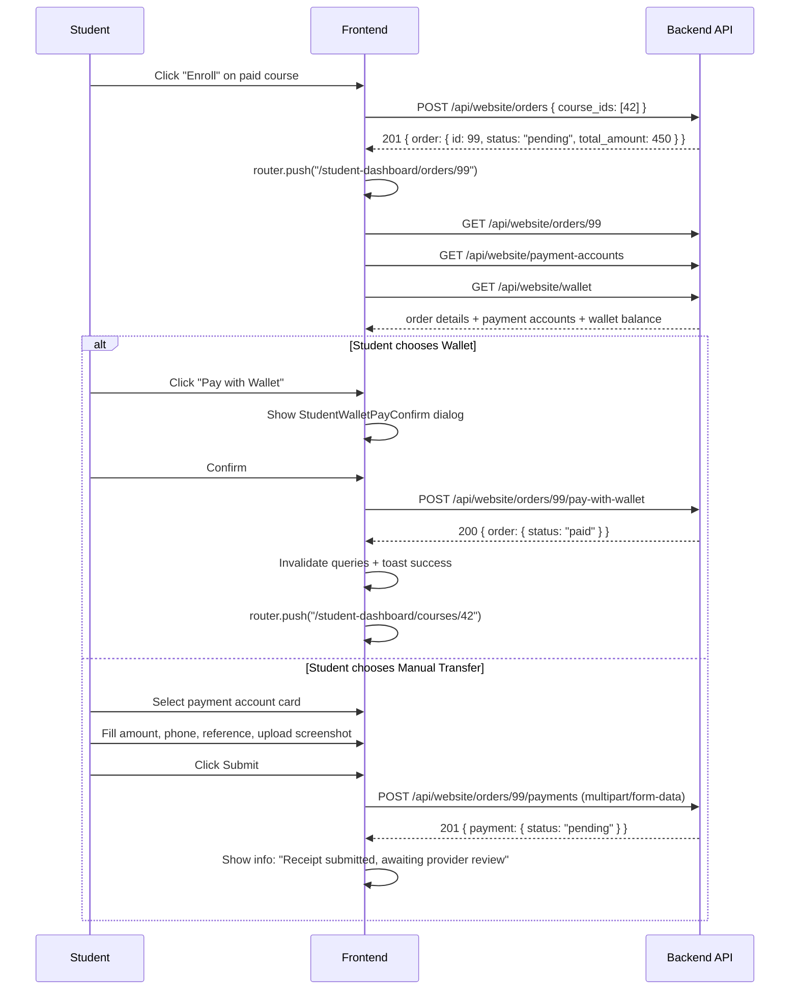

# Phase 8: Checkout, Payments & Student Wallet — Integration Guide

> **Phase**: 8 of 9
> **Scope**: Bullet Point 1 — Course Checkout & Order Creation
> **Status**: Not Started
> **Reference Plan**: [`INTEGRATION_PLAN.md`](./INTEGRATION_PLAN.md) — Phase 8

---

## Table of Contents

1. [Phase 8 Overview](#1-phase-8-overview)
2. [APIs & Endpoints](#2-apis--endpoints)
3. [Request & Response Schemas](#3-request--response-schemas)
4. [TypeScript Contracts](#4-typescript-contracts)
5. [Existing Pages & Components](#5-existing-pages--components)
6. [Pages & Components To Create](#6-pages--components-to-create)
7. [Implementation Plan — Bullet 1](#7-implementation-plan)

---

## 1. Phase 8 Overview

### Objective

Replace client-side checkout mocks with server-side order lifecycle. The full phase has 3 bullet points:

| #     | Bullet                               | Scope                                                                                    |
| ----- | ------------------------------------ | ---------------------------------------------------------------------------------------- |
| **1** | **Course Checkout & Order Creation** | Create orders, display payment accounts, submit manual transfer receipt, pay with wallet |
| 2     | Student Wallet Portal                | Wallet balance page + full transaction ledger                                            |
| 3     | Activation Code Redemption           | Instant code enrollment unlock                                                           |

---

## 2. APIs & Endpoints

All endpoints require student Sanctum Bearer token (`Authorization: Bearer <token>`) and `Accept-Language: ar|en` headers.

### 2.1 Bullet 1 — Course Checkout & Order Creation

| Method | Endpoint                                      | Auth    | Description                                                                                 |
| ------ | --------------------------------------------- | ------- | ------------------------------------------------------------------------------------------- |
| `POST` | `/api/website/orders`                         | Student | Create a new order for one or more courses. Free courses are auto-fulfilled immediately.    |
| `GET`  | `/api/website/orders`                         | Student | List authenticated student orders (paginated).                                              |
| `GET`  | `/api/website/orders/{order}`                 | Student | Get a single order by ID.                                                                   |
| `GET`  | `/api/website/payment-accounts`               | Student | Fetch provider payment accounts (Instapay, Vodafone Cash, Bank) to display during checkout. |
| `POST` | `/api/website/orders/{order}/payments`        | Student | Upload a manual bank transfer receipt screenshot (multipart/form-data).                     |
| `POST` | `/api/website/orders/{order}/pay-with-wallet` | Student | Instantly deduct the order total from student wallet balance.                               |

### 2.2 Bullet 2 — Student Wallet Portal (service layer already done)

| Method | Endpoint                           | Auth    | Description                          |
| ------ | ---------------------------------- | ------- | ------------------------------------ |
| `GET`  | `/api/website/wallet`              | Student | Get wallet balance & currency.       |
| `GET`  | `/api/website/wallet/transactions` | Student | Paginated wallet transaction ledger. |

> **Note**: `useStudentWebsiteWallet`, `useStudentWebsiteWalletTransactions`, and `student-wallet-service.ts` already exist from Phase 7. No new service layer needed for bullet 2 — only the **page/UI** is missing.

---

## 3. Request & Response Schemas

### 3.1 `POST /api/website/orders` — Create Order

**Request Body** (`application/json`):

```json
{
  "course_ids": [42],
  "delivery_modes": { "42": "online" }
}
```

**Validation Rules** (`StoreOrderRequest.php`):

| Field            | Type        | Rule                                                                                   |
| ---------------- | ----------- | -------------------------------------------------------------------------------------- |
| `course_ids`     | `integer[]` | Required, 1–20 items, each must be a valid `Course.id`                                 |
| `delivery_modes` | `object`    | Optional. Keys are `course_id` strings, values: `"online"` or `"onsite"` or `"hybrid"` |

**Response** (`201`):

```json
{
  "status": 201,
  "message": "Order created successfully.",
  "data": { "order": { "...BackendOrder..." } }
}
```

**Key business logic**:

- `total_amount = 0` (free course) → order auto-paid, enrollment activated immediately, no further payment needed.
- `total_amount > 0` → order is `pending`, student must pay via wallet or manual transfer.

---

### 3.2 `GET /api/website/payment-accounts`

**Response** (`200`):

```json
{
  "status": 200,
  "message": "OK",
  "data": {
    "payment_accounts": [
      {
        "id": 1,
        "type": "instapay",
        "type_label": "InstaPay",
        "account_name": { "ar": "حساب الشركة", "en": "Company Account" },
        "account_number": "01234567890",
        "instructions": { "ar": "أرسل إيصال التحويل", "en": "Please send transfer receipt" },
        "is_active": true,
        "created_at": "2025-01-01T00:00:00.000000Z"
      }
    ]
  }
}
```

Payment account `type` values: `"instapay"` | `"vodafone_cash"` | `"bank"` | `"fawry"` | `"credit_card"` | `"wallet"`

---

### 3.3 `POST /api/website/orders/{order}/payments` — Submit Manual Payment

**Request Body** (`multipart/form-data`):

| Field                   | Type      | Rule                                                |
| ----------------------- | --------- | --------------------------------------------------- |
| `payment_account_id`    | `integer` | Required. Must exist in `provider_payment_accounts` |
| `amount`                | `decimal` | Required, `> 0`, max 2 decimal places               |
| `proof`                 | `File`    | Required. MIME: `jpg,jpeg,png,webp`, max 4MB        |
| `submitted_phone`       | `string`  | Optional, max 40 chars                              |
| `transaction_reference` | `string`  | Optional, max 255 chars                             |
| `idempotency_key`       | `UUID v4` | Required. Generate with `crypto.randomUUID()`       |

**Response** (`201`):

```json
{
  "status": 201,
  "message": "Payment submitted for review.",
  "data": { "payment": { "...BackendPayment..." } }
}
```

---

### 3.4 `POST /api/website/orders/{order}/pay-with-wallet`

**Request Body** (`application/json`):

```json
{ "idempotency_key": "550e8400-e29b-41d4-a716-446655440000" }
```

**Validation** (`PayOrderWithWalletRequest.php`):

| Field             | Type      | Rule     |
| ----------------- | --------- | -------- |
| `idempotency_key` | `UUID v4` | Required |

**Authorization**: Student must be the order owner (`order.student_id === auth.id`).

**Response** (`200`):

```json
{
  "status": 200,
  "message": "Order paid successfully.",
  "data": { "order": { "...BackendOrder (status: paid)..." } }
}
```

---

### 3.5 BackendOrder Object Shape

```typescript
interface BackendOrder {
  id: number;
  order_number: string; // "ORD-20250101-000001"
  invoice_number?: string | null;
  provider_id: number;
  student_id: number;
  student?: BackendStudent | null;
  status: "pending" | "paid" | "partially_paid" | "cancelled" | "refunded";
  status_label?: string;
  subtotal: number | string;
  discount_amount: number | string;
  total_amount: number | string;
  paid_amount: number | string;
  remaining_amount: number | string;
  currency_code?: string | null;
  items?: BackendOrderItem[];
  payments?: BackendPayment[];
  paid_at?: string | null;
  created_at: string;
  updated_at?: string;
}
```

### 3.6 BackendOrderItem Object Shape

```typescript
interface BackendOrderItem {
  id: number;
  course_id: number;
  course_title: Record<string, string>; // { ar: "...", en: "..." }
  instructor_name?: string | null;
  educational_stage_name?: Record<string, string> | null;
  delivery_mode: string;
  selected_delivery_mode?: string | null;
  original_price: number | string;
  discount_amount?: number | string;
  final_price: number | string;
  access_duration_days?: number | null;
}
```

### 3.7 BackendPayment Object Shape

```typescript
interface BackendPayment {
  id: number;
  payment_number: string;
  order_id: number;
  method: "instapay" | "vodafone_cash" | "bank" | "wallet" | "fawry" | "credit_card";
  method_label?: string;
  status: "pending" | "approved" | "rejected";
  status_label?: string;
  amount: number | string;
  currency_code?: string | null;
  payment_account_id?: number | null;
  submitted_phone?: string | null;
  transaction_reference?: string | null;
  proof?: { url: string; file_name: string; mime_type: string } | null;
  rejection_reason?: string | null;
  created_at: string;
}
```

### 3.8 BackendPaymentAccount Object Shape

```typescript
interface BackendPaymentAccount {
  id: number;
  provider_id: number;
  type: "instapay" | "vodafone_cash" | "bank" | "wallet" | "fawry" | "credit_card";
  type_label?: string;
  account_name: Record<string, string>;
  account_number: string;
  instructions?: Record<string, string> | null;
  is_active: boolean;
  created_at: string;
}
```

---

## 4. TypeScript Contracts

### 4.1 Types That Already Exist in api-contracts.ts

| Type                         | Approx. Lines | Status |
| ---------------------------- | ------------- | ------ |
| `BackendOrder`               | 1096–1120     | Exists |
| `BackendOrderItem`           | 1080–1094     | Exists |
| `BackendPayment`             | 1122–1157     | Exists |
| `BackendPaymentAccount`      | 1068–1078     | Exists |
| `BackendOrderStatus`         | 1057          | Exists |
| `BackendPaymentStatus`       | 1058          | Exists |
| `BackendPaymentMethod`       | 1059–1066     | Exists |
| `StoreStudentOrderPayload`   | 1492–1495     | Exists |
| `StoreStudentOrderResponse`  | 1497–1499     | Exists |
| `OrdersListResponse`         | 1196–1199     | Exists |
| `PaymentsListResponse`       | 1201–1204     | Exists |
| `WalletTransactionsResponse` | 983–986       | Exists |

### 4.2 New Types to Add (api-contracts.ts)

```typescript
// ─── Phase 8 Bullet 1: Student Checkout & Order Payment ─────────────────────

/** POST /api/website/orders/{order}/payments */
export interface SubmitManualPaymentPayload {
  payment_account_id: number;
  amount: number;
  proof: File;
  submitted_phone?: string;
  transaction_reference?: string;
  idempotency_key: string;
}

export interface SubmitManualPaymentResponse {
  payment: BackendPayment;
}

/** POST /api/website/orders/{order}/pay-with-wallet */
export interface PayWithWalletPayload {
  idempotency_key: string;
}

export interface PayWithWalletResponse {
  order: BackendOrder;
}

/** GET /api/website/payment-accounts */
export interface StudentPaymentAccountsResponse {
  payment_accounts: BackendPaymentAccount[];
}

export interface StudentOrderFilterParams {
  search?: string;
  status?: BackendOrderStatus;
  sort?: string;
  page?: number;
  per_page?: number;
}
```

---

## 5. Existing Pages & Components

### 5.1 Pages That Already Exist

| Route                                   | Page File             | Component                     | Status           |
| --------------------------------------- | --------------------- | ----------------------------- | ---------------- |
| `/student-dashboard/courses/explore`    | `explore/page.tsx`    | `StudentExploreCoursesClient` | Live (Phase 6/7) |
| `/student-dashboard/courses/[courseId]` | `[courseId]/page.tsx` | `StudentCourseDetailClient`   | Live (Phase 7)   |

### 5.2 Components With Partial / Missing Checkout Logic

| Component                   | File                                          | Current State                                                                                                                                                                           | Gap                                                    |
| --------------------------- | --------------------------------------------- | --------------------------------------------------------------------------------------------------------------------------------------------------------------------------------------- | ------------------------------------------------------ |
| `StudentCoursePreviewView`  | `course-detail/StudentCoursePreviewView.tsx`  | Shows price + "Enroll" button. Calls `onEnroll(courseId)` → creates order. Works fine for free courses. For paid courses, order is `pending` but student has no UI to complete payment. | Missing checkout flow for paid courses                 |
| `StudentCourseDetailClient` | `course-detail/StudentCourseDetailClient.tsx` | Uses `useStudentEnroll()`. On success shows a toast. For paid courses enrollment is NOT activated — order is just `pending` with no redirect.                                           | No redirect to payment page after paid order creation  |
| `useStudentEnroll`          | `hooks/use-student-enroll.ts`                 | Only creates the order. Returns `StoreStudentOrderResponse`. Invalidates student queries on success.                                                                                    | No handling for paid orders, no navigation to checkout |

### 5.3 Services That Already Exist

| Service                               | File                         | What It Does                             | What's Missing                                    |
| ------------------------------------- | ---------------------------- | ---------------------------------------- | ------------------------------------------------- |
| `exploreCoursesService.createOrder()` | `explore-courses-service.ts` | `POST /api/website/orders`               | Payment accounts, submit payment, pay with wallet |
| `studentWalletService`                | `student-wallet-service.ts`  | `GET /api/website/wallet` + transactions | Complete for bullet 2                             |

### 5.4 Hooks That Already Exist

| Hook                                    | File                    | Status             |
| --------------------------------------- | ----------------------- | ------------------ |
| `useStudentEnroll()`                    | `use-student-enroll.ts` | Creates order      |
| `useStudentWebsiteWallet()`             | `use-student-wallet.ts` | Wallet balance     |
| `useStudentWebsiteWalletTransactions()` | `use-student-wallet.ts` | Transaction ledger |

### 5.5 Query Keys Already Registered

```typescript
// Already in queryKeys.ts:
queryKeys.student.wallet();
queryKeys.student.walletTransactions(filters);

// Need to add:
queryKeys.student.orders(filters);
queryKeys.student.orderDetail(orderId);
queryKeys.student.paymentAccounts();
```

---

## 6. Pages & Components To Create

### 6.1 New Service File

**`src/lib/api/student-orders-service.ts`** (new file)

| Function                                | Endpoint                                           | Notes                                |
| --------------------------------------- | -------------------------------------------------- | ------------------------------------ |
| `getOrders(params?)`                    | `GET /api/website/orders`                          | Student order list                   |
| `getOrder(orderId)`                     | `GET /api/website/orders/{order}`                  | Single order detail                  |
| `getPaymentAccounts()`                  | `GET /api/website/payment-accounts`                | Provider payment accounts            |
| `submitManualPayment(orderId, payload)` | `POST /api/website/orders/{order}/payments`        | multipart/form-data with proof image |
| `payWithWallet(orderId, payload)`       | `POST /api/website/orders/{order}/pay-with-wallet` | Wallet deduction                     |

### 6.2 New Hooks File

**`src/hooks/use-student-orders.ts`** (new file)

| Hook                          | Type          | Purpose                                |
| ----------------------------- | ------------- | -------------------------------------- |
| `useStudentOrders(filters?)`  | `useQuery`    | List orders                            |
| `useStudentOrder(orderId)`    | `useQuery`    | Single order                           |
| `useStudentPaymentAccounts()` | `useQuery`    | Provider payment accounts for checkout |
| `useSubmitManualPayment()`    | `useMutation` | Upload receipt                         |
| `usePayWithWallet()`          | `useMutation` | Wallet payment                         |

### 6.3 New Pages

| Route                                 | File to Create              | Purpose                               |
| ------------------------------------- | --------------------------- | ------------------------------------- |
| `/student-dashboard/orders`           | `orders/page.tsx`           | Student order history list            |
| `/student-dashboard/orders/[orderId]` | `orders/[orderId]/page.tsx` | Single order detail + payment actions |

### 6.4 New Components

| Component                              | File                                              | Purpose                                            |
| -------------------------------------- | ------------------------------------------------- | -------------------------------------------------- |
| `StudentOrdersClient`                  | `orders/StudentOrdersClient.tsx`                  | Order list with status badges                      |
| `StudentOrderDetailClient`             | `orders/StudentOrderDetailClient.tsx`             | Full order view + payment method selection         |
| `StudentCheckoutPaymentMethodSelector` | `orders/StudentCheckoutPaymentMethodSelector.tsx` | Card list of provider payment accounts             |
| `StudentManualPaymentForm`             | `orders/StudentManualPaymentForm.tsx`             | Form: amount, phone, reference, proof image upload |
| `StudentWalletPayConfirm`              | `orders/StudentWalletPayConfirm.tsx`              | Confirm dialog for wallet deduction                |

### 6.5 Modifications to Existing Files

| File                                                                           | Modification                                                                                                                                       |
| ------------------------------------------------------------------------------ | -------------------------------------------------------------------------------------------------------------------------------------------------- |
| `src/types/api-contracts.ts`                                                   | Add new types from §4.2                                                                                                                            |
| `src/lib/api/queryKeys.ts`                                                     | Add `orders`, `orderDetail`, `paymentAccounts` to student namespace                                                                                |
| `src/hooks/use-student-enroll.ts`                                              | No change needed — caller handles navigation                                                                                                       |
| `src/components/dashboard/student/course-detail/StudentCourseDetailClient.tsx` | On `enrollMutation` success: if `order.status === "paid"` show toast; if `order.status === "pending"` redirect to `/student-dashboard/orders/{id}` |

---

## 7. Implementation Plan — Bullet 1: Course Checkout & Order Creation

> **Goal**: When a student clicks "Enroll" on a paid course, they are routed to a checkout page to pay via wallet or submit a manual bank transfer receipt. Free courses continue to auto-enroll immediately.

### Step 1 — TypeScript Contracts

**File**: `src/types/api-contracts.ts`

Add new interfaces from §4.2 at the end of the file after the existing student exam types.

---

### Step 2 — Query Keys

**File**: `src/lib/api/queryKeys.ts`

Add inside the `student` namespace block:

```typescript
orders: (filters?: Record<string, unknown>) =>
  [...queryKeys.student.all, "orders", filters ?? {}] as const,
orderDetail: (orderId: number | string) =>
  [...queryKeys.student.all, "order", orderId] as const,
paymentAccounts: () =>
  [...queryKeys.student.all, "paymentAccounts"] as const,
```

---

### Step 3 — Student Orders Service

**File**: `src/lib/api/student-orders-service.ts` (new)

- `getOrders` and `getOrder` use standard `api()` GET calls with response normalization matching the pattern in `billing-service.ts`.
- `getPaymentAccounts` unwraps the `payment_accounts` array from the response envelope.
- `submitManualPayment` builds a `FormData` object (mirrors `lessons-service.ts` FormData pattern) and sets `Content-Type: multipart/form-data`.
- `payWithWallet` posts `{ idempotency_key }` as JSON.

---

### Step 4 — Student Orders Hooks

**File**: `src/hooks/use-student-orders.ts` (new)

- `useStudentOrders` and `useStudentOrder` are standard `useQuery` wrappers with `staleTime: 30_000`.
- `useStudentPaymentAccounts` has `staleTime: 5 * 60 * 1000` (5 min — accounts rarely change).
- `useSubmitManualPayment` mutation: on success, invalidates `orderDetail(orderId)`.
- `usePayWithWallet` mutation: on success, invalidates `orderDetail(orderId)`, `student.myCourses()`, `student.wallet()`, and the specific `courseDetail`.

---

### Step 5 — Order List Page

**Files**:

- `src/app/[locale]/(main)/(student-dashboard)/student-dashboard/orders/page.tsx`
- `src/components/dashboard/student/orders/StudentOrdersClient.tsx`

Shows paginated order list with status badges:

- `pending` → amber badge
- `paid` → green badge
- `cancelled` / `refunded` → red/gray badge

Clicking an order row navigates to `/student-dashboard/orders/{id}`.

---

### Step 6 — Order Detail + Checkout Page

**Files**:

- `src/app/[locale]/(main)/(student-dashboard)/student-dashboard/orders/[orderId]/page.tsx`
- `src/components/dashboard/student/orders/StudentOrderDetailClient.tsx`
- `src/components/dashboard/student/orders/StudentCheckoutPaymentMethodSelector.tsx`
- `src/components/dashboard/student/orders/StudentManualPaymentForm.tsx`
- `src/components/dashboard/student/orders/StudentWalletPayConfirm.tsx`

**UI Layout for Pending Orders**:

```
+-------------------------------------------------------+
|  Order #ORD-20250101-000001          Status: Pending  |
+------------------------------+------------------------+
|  Order Items                 |  Payment Summary       |
|  - Course title              |  Subtotal:   500 EGP   |
|  - Price breakdown           |  Discount:    50 EGP   |
|                              |  Total:      450 EGP   |
+------------------------------+------------------------+
|  HOW WOULD YOU LIKE TO PAY?                          |
|  +---------------------+  +-----------------------+  |
|  | Pay from Wallet      |  | Manual Transfer       |  |
|  | Balance: 300 EGP     |  | (Upload Receipt)      |  |
|  | [disabled if low]    |  |                       |  |
|  +---------------------+  +-----------------------+  |
|                                                       |
|  [If Manual Transfer Selected]                        |
|  1. Select payment account (InstaPay / Bank / etc.)   |
|  2. Fill in: amount, phone, transaction ref           |
|  3. Upload receipt screenshot                         |
|  4. Submit                                            |
+-------------------------------------------------------+
```

**Logic**:

- Parallel fetch: `useStudentOrder(orderId)` + `useStudentPaymentAccounts()` + `useStudentWebsiteWallet()`.
- Wallet tab: shows balance. Disabled if `Number(wallet.balance) < Number(order.remaining_amount)`.
- Manual transfer tab: shows `StudentCheckoutPaymentMethodSelector` with account cards, then `StudentManualPaymentForm`.
- Paid orders: show read-only order summary with payment history, no payment actions.

---

### Step 7 — Modify StudentCourseDetailClient

**File**: `src/components/dashboard/student/course-detail/StudentCourseDetailClient.tsx`

```typescript
// Add import:
import { useRouter } from "next/navigation";

// Inside component:
const router = useRouter();

// Modify handleEnroll:
const handleEnroll = (targetCourseId: number) => {
  enrollMutation.mutate(
    { course_ids: [targetCourseId] },
    {
      onSuccess: (data) => {
        if (data.order.status === "paid") {
          // Free course — enrollment activated immediately
          toast.success(tPreview("enrollSuccess"));
        } else {
          // Paid course — redirect to checkout page
          router.push(`/student-dashboard/orders/${data.order.id}`);
        }
      },
    },
  );
};
```

---

### Step 8 — Sidebar Navigation

Add a "My Orders" nav link to the student sidebar (if not already present).
Route: `/student-dashboard/orders`
Icon: `ShoppingBag` or `Receipt` from lucide-react.

---

## Checkout Sequence Diagram



---

## Key Implementation Notes

1. **Idempotency Keys**: Generate with `crypto.randomUUID()` immediately before submitting any payment mutation. Regenerate on retry/re-render.

2. **Free vs Paid Branch**: In `onSuccess` of `enrollMutation`, check `data.order.status`. `"paid"` = free course auto-enrolled. `"pending"` = redirect to checkout.

3. **multipart/form-data**: Use `FormData` for `submitManualPayment`. Do NOT JSON-stringify. The `api()` client auto-sets `Content-Type: multipart/form-data` when receiving a `FormData` body.

4. **Wallet Balance Guard**: `Number(wallet.balance) < Number(order.remaining_amount)` → disable wallet pay button, show "Insufficient balance" warning.

5. **422 Field Errors**: `POST .../payments` may return `errors.proof` (invalid file type/size) or `errors.amount`. Display as field-level errors in `StudentManualPaymentForm`.

6. **Post-Payment Invalidation** (`usePayWithWallet` onSuccess):
   - `queryKeys.student.wallet()`
   - `queryKeys.student.orderDetail(orderId)`
   - `queryKeys.student.myCourses()`
   - `queryKeys.student.courseDetail(courseId)` (if available in context)

7. **Already Paid Orders**: If `order.status === "paid"`, the order detail page should show a read-only summary with payment history only — no payment action UI.
